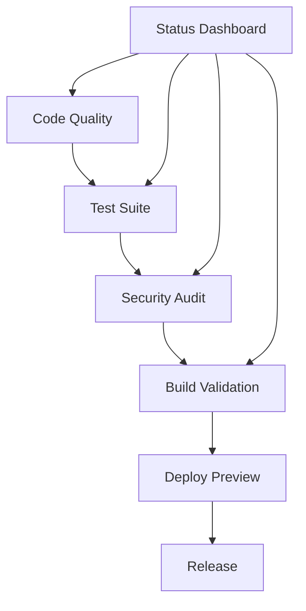

# 🚀 CI/CD Pipeline Documentation

This repository uses a comprehensive GitHub Actions CI/CD pipeline to ensure code quality, security, and reliability.

## 📋 Workflow Overview

### 🔍 Code Quality - ESLint & TypeScript

- **Triggers**: Push to main/develop, PRs, daily at 1 AM UTC
- **Purpose**: Linting, type checking, and code formatting
- **Matrix**: Node.js 20 & 22
- **Features**:
  - ESLint with ReviewDog integration
  - TypeScript type checking
  - Prettier formatting validation
  - PR review comments for issues

### 🧪 Test Suite

- **Triggers**: Push to main/develop, PRs, daily at 2 AM UTC
- **Purpose**: Comprehensive testing and coverage
- **Matrix**: Node.js 20 & 22
- **Features**:
  - Jest test execution
  - Coverage reporting with Codecov
  - Performance testing
  - Test watch mode for PRs

### 🔒 Security Audit

- **Triggers**: Push to main/develop, PRs, daily at 3 AM UTC
- **Purpose**: Security vulnerability scanning
- **Features**:
  - npm audit with detailed reporting
  - CodeQL analysis
  - Dependency review
  - Security headers validation

### 🏗️ Build Validation

- **Triggers**: Push to main/develop, PRs, daily at 4 AM UTC
- **Purpose**: Production build verification
- **Matrix**: Node.js 20 & 22
- **Features**:
  - Production build testing
  - Bundle size analysis
  - Lighthouse CI performance checks
  - Build performance metrics

### 🚀 Deploy Preview

- **Triggers**: PRs to main/develop
- **Purpose**: Preview deployments for PRs
- **Features**:
  - Vercel preview deployment
  - Performance testing on preview
  - Automatic PR comments with preview URL

### 📦 Release

- **Triggers**: Git tags, manual dispatch
- **Purpose**: Automated releases
- **Features**:
  - Changelog generation
  - GitHub release creation
  - Build artifact upload
  - Release notifications

### 📊 Workflow Status Dashboard

- **Triggers**: Workflow completions, daily at 6 AM UTC
- **Purpose**: Monitor workflow health
- **Features**:
  - Workflow status tracking
  - Failure detection and alerting
  - Repository health metrics
  - Automatic issue creation for persistent failures

## 🛠️ Local Development

### Prerequisites

- Node.js 20+
- npm 9+

### Setup

```bash
# Install dependencies
npm ci

# Run tests
npm test

# Run linting
npm run lint

# Run type checking
npm run type-check

# Run security audit
npm run audit

# Build application
npm run build
```

### Pre-commit Hooks

The repository uses Husky for pre-commit hooks:

- Code formatting with Prettier
- Linting with ESLint
- Type checking with TypeScript
- Security audit
- Test execution
- Build validation

### Commit Message Format

We use conventional commits:

```
feat: add new feature
fix: fix bug
docs: update documentation
style: formatting changes
refactor: code refactoring
test: add tests
chore: maintenance tasks
```

## 🔧 Configuration Files

### ESLint

- `eslint.config.mjs` - ESLint configuration
- Supports Next.js, TypeScript, and accessibility rules

### Prettier

- `.prettierrc` - Code formatting rules
- Integrated with ESLint for consistent formatting

### Jest

- `jest.config.js` - Test configuration
- `jest.setup.js` - Test environment setup
- Coverage thresholds and reporting

### Husky

- `.husky/pre-commit` - Pre-commit validation
- `.husky/commit-msg` - Commit message validation
- `.husky/pre-push` - Pre-push validation

### Lint-staged

- `.lintstagedrc.json` - Staged file processing
- Runs linters only on changed files

## 📈 Monitoring & Metrics

### Code Quality Metrics

- ESLint error/warning counts
- TypeScript type coverage
- Code formatting compliance
- Test coverage percentage

### Performance Metrics

- Build time tracking
- Bundle size monitoring
- Lighthouse performance scores
- Core Web Vitals tracking

### Security Metrics

- Vulnerability count
- Dependency health
- Security header compliance
- CodeQL analysis results

## 🚨 Troubleshooting

### Common Issues

#### Workflow Failures

1. Check the workflow logs in GitHub Actions
2. Run the same commands locally to reproduce
3. Check for dependency issues with `npm audit`
4. Verify Node.js version compatibility

#### Pre-commit Hook Failures

```bash
# Fix formatting issues
npm run format

# Fix linting issues
npm run lint:fix

# Check types
npm run type-check

# Run security audit
npm run audit
```

#### Test Failures

```bash
# Run tests locally
npm test

# Run with coverage
npm run test:coverage

# Debug tests
npm run test:debug
```

### Getting Help

- Check workflow logs in GitHub Actions
- Review the [GitHub Actions documentation](https://docs.github.com/en/actions)
- Open an issue for persistent problems

## 🔄 Workflow Dependencies



## 📊 Performance Benchmarks

### Target Metrics

- **Build Time**: < 2 minutes
- **Test Coverage**: > 70%
- **Lighthouse Performance**: > 80
- **Bundle Size**: < 500KB (First Load JS)
- **Security Vulnerabilities**: 0

### Current Status

Check the [Workflow Status Dashboard](https://github.com/Praveenskg/smart-tools/actions) for real-time metrics.

---

_This documentation is automatically updated with workflow changes._
